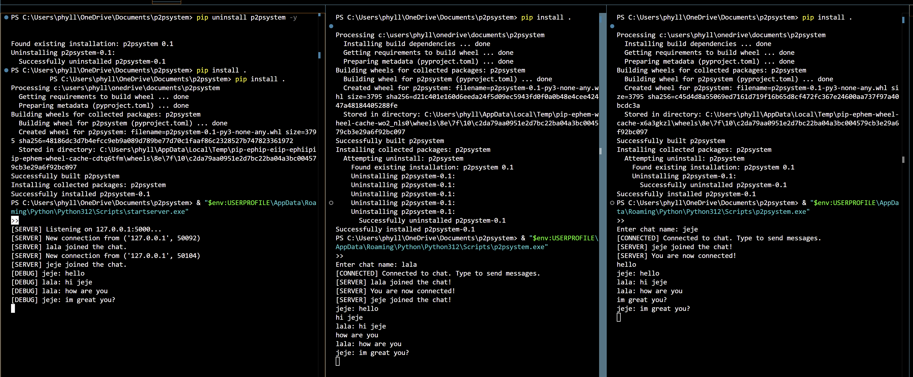

# P2P Chat Framework (Phase 1)

This is a simple peer-to-peer (P2P) chat system built in Python using **sockets**, **threading**, and **asyncio**.

It functions as a basic client-server chat room.  
Each client connects to the server, enters a chat alias, and can send messages to everyone else.

---

## 🚀 How it works

- **Server (`server.py`)**
  - Listens for new client connections.
  - Keeps track of all connected users.
  - Broadcasts labeled messages to all connected users.
  - Removes users when they disconnect.

- **Client (`client.py`)**
  - Connects to the server and chooses a chat name (alias).
  - Can send and receive messages simultaneously using `asyncio`.
  - Sees each message with the sender’s name (e.g., `phyliss: hello`).
  - Automatically leaves the chat if disconnected.

---

## ⚙️ How to Install with pip

You can install and run the P2P system as a local Python package with CLI commands.

1. **Navigate to the project root (where `setup.py` is)**  
    Then run:

    ```bash
    pip install .
    ```

2. If you're on Windows and see:

    ```
    The scripts startserver.exe and p2psystem.exe are installed in...
    ```

    You can either:
    - Add that folder to your system PATH, or
    - Use the full path to run the tools directly.

---

### 🖼️ Screenshot: CLI Command Working After pip install

> Demonstrating that the server successfully runs after installation:



---

## 💬 How to Run the Chat System

### ✅ Option 1: From Source (no pip install)

1. **Run the server**
    ```bash
    python p2psystem/server.py
    ```

2. **Run the client**
    ```bash
    python p2psystem/client.py
    ```

---

### ✅ Option 2: From Anywhere (after pip install)

1. **Start the server (terminal 1):**
    ```bash
    startserver
    ```
    > Or manually (if not on PATH):
    ```bash
    & "$env:USERPROFILE\AppData\Roaming\Python\Python312\Scripts\startserver.exe"
    ```

2. **Start the client (terminal 2 or more):**
    ```bash
    p2psystem
    ```
    > Or manually:
    ```bash
    & "$env:USERPROFILE\AppData\Roaming\Python\Python312\Scripts\p2psystem.exe"
    ```

3. **Start chatting!**
    - Enter an alias when prompted
    - Type messages and press Enter to send
    - Messages will appear like: `nene: hey`
    - Try opening multiple terminals to simulate a group chat

---

## 📌 Requirements

- Python 3.x  
  No external libraries needed — only built-in modules: `socket`, `threading`, and `asyncio`.

---

## 🎯 Next Steps (Future Improvements)

- `/exit` command → leave the chat gracefully
- `/users` command → list online users
- Private messaging between users
- Optional encrypted messaging
- WebSocket upgrade (Flask or FastAPI version)

---
